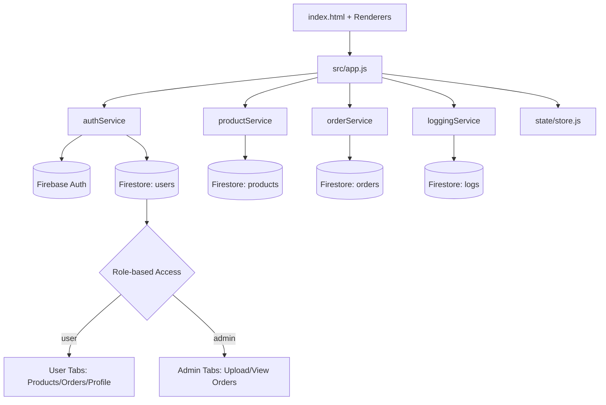

# Architecture Diagram

```mermaid
flowchart TB
  UI[index.html + Renderers] --> APP[src/app.js]
  APP --> AUTH[authService]
  APP --> PRODUCT[productService]
  APP --> ORDER[orderService]
  APP --> LOG[loggingService]
  APP --> STATE[state/store.js]

  AUTH --> FA[(Firebase Auth)]
  AUTH --> USERS[(Firestore: users)]
  PRODUCT --> PRODUCTS[(Firestore: products)]
  ORDER --> ORDERS[(Firestore: orders)]
  LOG --> LOGS[(Firestore: logs)]

  USERS --> ROLE{Role-based Access}
  ROLE -->|user| USERFLOW[User Tabs: Products/Orders/Profile]
  ROLE -->|admin| ADMINFLOW[Admin Tabs: Upload/View Orders]
```

## Components
- Presentation: HTML + CSS + renderer module
- Controller: `src/app.js`
- Data access: service modules
- Persistence: Firebase Auth + Firestore
